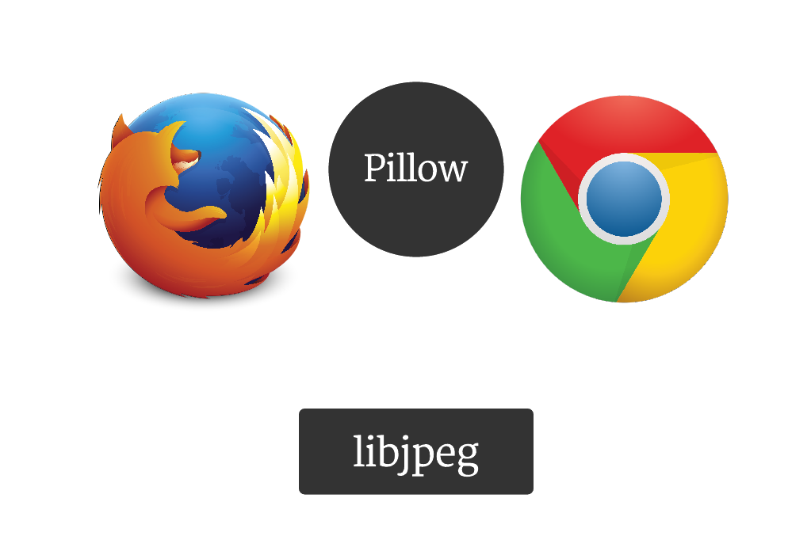

## My Python's a Little Rusty

#### Dan Callahan &middot; dcallahan@mozilla.com &middot; @callahad

---

## The Big Lie

 

> "Python's fast enough, and  
> I can always write a C extension."

 

But it's not, and we never do.
<!-- .element: class="fragment" -->

---

## Why don't we write C?

***

### 1. Other people did it for us.

***

### Lines of C/C++ in Projects

|     Project     | # Lines |  %  |
| --------------- | -------:| ---:|
| CPython 3.5.0a2 | 399,387 | 43% |
| NumPy 1.9.2     | 166,034 | 62% |
| Pillow 2.7.0    |  22,669 | 52% |
| MarkupSafe 0.23 |     178 | 21% |

***

### We're standing on the shoulders of giants.

### And so are they.
<!-- .element: class="fragment" -->

<!-- .element: class="fragment" style="max-height: 65%; max-width: 65%;" -->

***

### 2. Writing C is **scary**.

***

### Memory management is **hard**.

- Heartbleed <!-- .element: class="fragment" -->
- Ghost <!-- .element: class="fragment" -->
- CVE-2015-0080 <!-- .element: class="fragment" -->

_I'm not smarter than the glibc or openssl devs._
<!-- .element: class="fragment" -->

---

## But what if you **need** to?

***

### The Dream

 

C's Performance, Portability, and Embeddability.

<!-- .element: class="fragment" --> With *guaranteed* safety.

---

## Rust.

---

## Stack vs. Heap

***

|      Stack      |     Heap      |
| --------------- | ------------- |
| Fast but tiny   | Slow but huge |
| Function locals | Globals       |
| Managed by CPU  | Unmanaged     |

 

_Only small values of known, fixed size can go on the stack.
 
Growable things like vectors must go on the heap._

---

## Managed vs unmanaged

***
<!-- .slide: data-background="img/ownership/01.jpg" -->
***
<!-- .slide: data-background="img/ownership/02.jpg" -->
***
<!-- .slide: data-background="img/ownership/03.jpg" -->
***
<!-- .slide: data-background="img/ownership/04.jpg" -->
***
<!-- .slide: data-background="img/ownership/04.jpg" -->

---

## Ownership

***
<!-- .slide: data-background="img/ownership/05.jpg" -->
***
<!-- .slide: data-background="img/ownership/06.jpg" -->
***
<!-- .slide: data-background="img/ownership/07.jpg" -->
***
<!-- .slide: data-background="img/ownership/08.jpg" -->
***
<!-- .slide: data-background="img/ownership/09.jpg" -->
***
<!-- .slide: data-background="img/ownership/10.jpg" -->
***
<!-- .slide: data-background="img/ownership/11.jpg" -->
***
<!-- .slide: data-background="img/ownership/12.jpg" -->
***
<!-- .slide: data-background="img/ownership/13.jpg" -->
***
<!-- .slide: data-background="img/ownership/14.jpg" -->
***
<!-- .slide: data-background="img/ownership/15.jpg" -->
***
<!-- .slide: data-background="img/ownership/16.jpg" -->
***
<!-- .slide: data-background="img/ownership/17.jpg" -->
***
<!-- .slide: data-background="img/ownership/18.jpg" -->
***
<!-- .slide: data-background="img/ownership/19.jpg" -->
***
<!-- .slide: data-background="img/ownership/20.jpg" -->
***

### Enforced Statically at Compile Time

 

- No dangling pointers
- No use after free vulnerabilities
- No pointer arithmetic
- No null pointer dereferencing

 

_This is a "Zero-Cost Abstraction."_

---

## Mutability Demos!

---

## Python FFI Demos!

---

## Learn More

_rust-lang.org_

---

## Questions?

 

@callahad

dcallahan@mozilla.com
